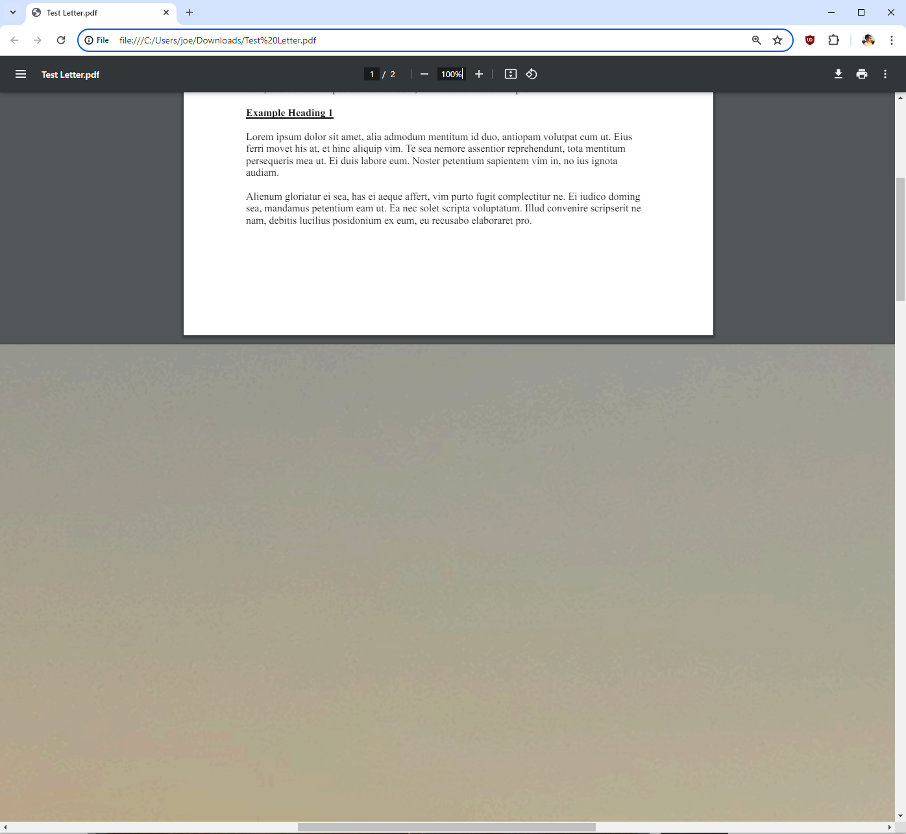
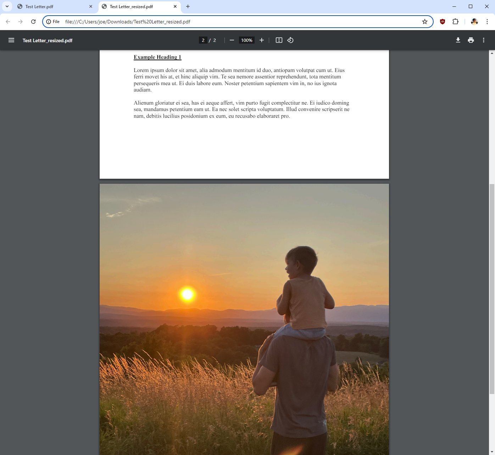

# PDF Resizer

This script resizes the pages of a PDF file to 8.5 x 11 inches (612 x 792 pixels).

Photos are often much larger than the standard 8.5 x 11 page size. When you include photos in PDFs together with standard-sized documents, the photos can be relatively HUGE. This is a problem for printing. It also makes reading the PDF annoying on certain apps like Chrome. Further, lawyers need need to electronically file litigation documents, and if they include PDFs with crazy-sized photos it can cause problems. Thus, this script resizes all pages of a PDF to the standard letter size for easier viewing and printing.

## Example

Before resizing:



<br>

After resizing:



## Requirements

- Python 3.x
- PyPDF2 library

## Usage

```bash
python pdf_resizer.py <input_file>
```

Replace `<input_file>` with the path to the PDF file you want to resize. You can provide either a relative path (if the PDF file is in the same directory as the script) or an absolute path.

The resized PDF will be saved in the same directory as the input file, with "\_resized" appended to the filename.

## License

This project is licensed under the MIT License. See the [LICENSE](LICENSE) file for details.
